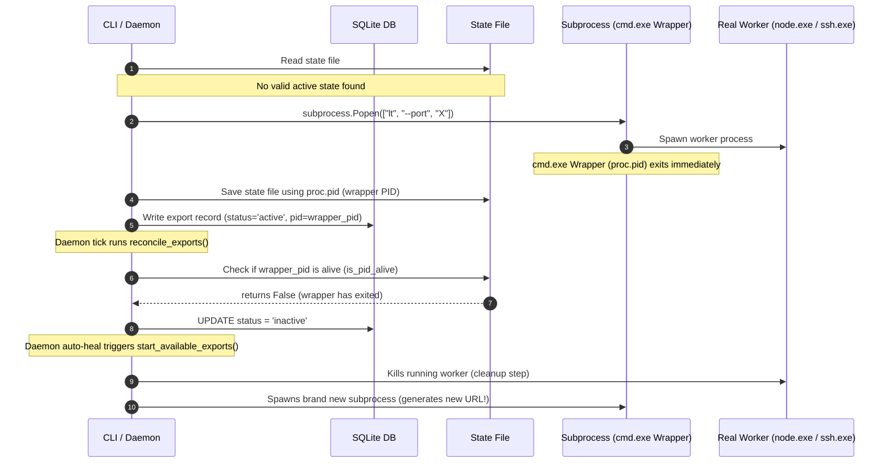
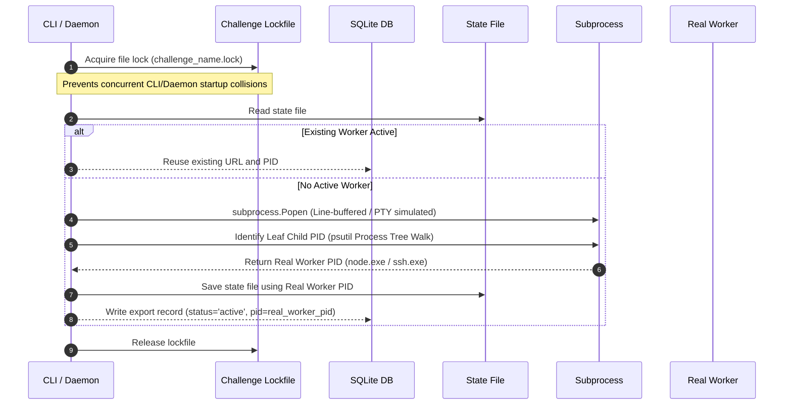

Fokus utama:
- localtunnel
- pinggy

Karena ngrok terlihat jauh lebih stabil.

## Problem Context

Saat menjalankan:

nxctl up --all

Sebagian besar container/challenge sebenarnya berhasil start dengan normal.

Masalah utama terjadi di export layer/tunnel provider.

Gejala yang muncul:
- localtunnel sering:
  - regenerate URL
  - HTTP 503
  - endpoint berubah-ubah
  - flapping
- pinggy kadang:
  - stuck di "Connecting to Pinggy..."
  - gagal startup
  - baru healthy setelah nxctl test
- ngrok relatif stabil dan jarang bermasalah

Contoh behavior:
- endpoint localtunnel berubah antar test
- provider dianggap failed saat up
- beberapa detik kemudian malah reachable
- auto-heal membuat endpoint baru
- PID tunnel berubah-ubah
- challenge/container tetap healthy

## Fokus Audit

Tolong audit area berikut:

1. Export orchestration
2. Tunnel lifecycle management
3. Auto-heal logic
4. Retry/backoff strategy
5. Readiness/health validation
6. Endpoint persistence
7. State synchronization
8. PID/process cleanup
9. Child-process handling
10. Race condition antar provider

## Cari kemungkinan bug berikut

### A. Tunnel recreated terlalu agresif
Kemungkinan:
- transient failure langsung dianggap fatal
- auto-heal terlalu cepat recreate tunnel
- endpoint jadi berubah terus

Audit:
- debounce/stabilization logic
- retry threshold
- healthcheck strategy

---

### B. State tidak sinkron
Gejala:
- provider dianggap failed
- tapi beberapa detik kemudian reachable
- test berikutnya healthy tanpa restart container

Audit:
- state machine export layer
- in-memory vs persisted state
- stale endpoint registry
- async update race condition

---

### C. PID/process lama tidak dibersihkan
Kemungkinan:
- orphan tunnel process
- zombie reconnect loop
- duplicate tunnel spawn

Audit:
- process spawning
- cleanup handler
- signal handling
- child-process lifecycle

---

### D. Readiness check terlalu cepat
Kemungkinan:
- tunnel belum fully ready
- langsung dianggap failed

Audit:
- startup timeout
- probing interval
- retry duration
- provider warmup handling

---

### E. Endpoint persistence rusak
Gejala:
- localtunnel URL berubah antar test
- endpoint lama invalid

Audit:
- endpoint reuse logic
- reconnect behavior
- tunnel replacement logic
- cache/state invalidation

## Expected Output

Tolong hasilkan:

1. Root cause analysis
2. Flow lifecycle export provider
3. Area code paling suspicious
4. Potensi race condition
5. Kenapa localtunnel/pinggy tidak stabil
6. Kenapa ngrok lebih stabil
7. Prioritas fix berdasarkan severity
8. Saran redesign architecture export layer
9. Saran observability/logging tambahan
10. Saran hardening untuk multi-provider concurrent startup

Gunakan pendekatan engineering audit mendalam, bukan sekadar summary log.

ini log jika butuh

---

I will begin by reviewing the codebase, starting with the base export class definition in `base.py` and then checking `manager.py`, `localtunnel.py`, and `pinggy.py`. This will help us understand the orchestration flow, state management, process spawning, and health validation logic.

First, let's view [base.py](file:///e:/9_org/nxctf/nxctl/src/nxctl/scripts/exports/base.py) to examine the base implementation and the interface/contract for export providers.

Viewed base.py:1-67

Now let's view [manager.py](file:///e:/9_org/nxctf/nxctl/src/nxctl/scripts/exports/manager.py) to see how the orchestration layer manages exports, performs health checks, auto-heals, and handles persistence.

Viewed manager.py:1-800

Let's view the remainder of [manager.py](file:///e:/9_org\nxctf\nxctl\src\nxctl\scripts\exports\manager.py) to inspect the rest of the class, especially any auto-heal, retry, or endpoint validation methods.

Viewed manager.py:800-1011

Now let's view [localtunnel.py](file:///e:/9_org/nxctf/nxctl/src/nxctl/scripts/exports/localtunnel.py) to analyze the localtunnel provider's lifecycle, process spawning, endpoint retrieval, and health validation logic.

Viewed localtunnel.py:1-239

Now let's view [pinggy.py](file:///e:/9_org/nxctf/nxctl/src/nxctl/scripts/exports/pinggy.py) to analyze the Pinggy provider's lifecycle, SSH/command spawning, and endpoint extraction logic.

Viewed pinggy.py:1-247

Let's examine the contents of the `data/exports` directory to see what logs or state files are available, which may give us insights into actual execution behavior, failure types, or state.

Listed directory exports

Let's search the workspace for references to `reconcile_exports` or "auto-heal" or how health validation and restarts are called in the daemon/orchestration layer to see exactly how these are triggered.

Searched for "reconcile_exports"

Let's list the contents of the `src/nxctl/scripts` directory to understand the layout and find any daemon/service orchestrators.

Listed directory scripts

Let's search for references to `export` in `challenge_service.py` and `runtime_service.py` to see where they are integrated into challenge startup, teardown, or monitoring.

Searched for "export"

Let's search for references to `ExportManager` across all files in `src/nxctl/scripts` to see how it is imported and used.

Searched for "ExportManager"

Let's search for "export" in [lifecycle.py](file:///e:/9_org/nxctf/nxctl/src/nxctl/scripts/cli/lifecycle.py) to see where and how tunnel exports are started, tested, or re-run during the challenge startup process (`up` command, etc.).

Searched for "export"

Let's view [lifecycle.py](file:///e:/9_org/nxctf/nxctl/src/nxctl/scripts/cli/lifecycle.py) to check the CLI orchestration details, especially during `nxctl up --all`.

Viewed lifecycle.py:1-544

Let's view the main entry point and configuration loading in [app.py](file:///e:/9_org/nxctf/nxctl/src/nxctl/app.py) to see how the settings, paths, and export parameters are initialized and managed.

Viewed app.py:1-239

Now let's view [base.py](file:///e:/9_org/nxctf/nxctl/src/nxctl/scripts/cli/base.py) to see how configuration and service objects are constructed.

Viewed base.py:1-42

Let's check the core configuration definition in [config.py](file:///e:/9_org/nxctf/nxctl/src/nxctl/core/config.py) to see the default settings for timeouts, retries, and other export provider options.

Viewed config.py:1-188

Let's locate where the utility functions (`kill_process`, `is_pid_alive`, etc.) are defined by searching for `def kill_process` in the workspace.

Searched for "def kill_process"

Let's view [utils.py](file:///e:/9_org/nxctf/nxctl/src/nxctl/core/utils.py) to check how `kill_process`, `is_pid_alive`, and process lifecycles are checked and executed.

Viewed utils.py:1-189

Let's list the contents of the `locks` directory in `data/exports` to see if there are lock files or if a file-locking mechanism exists.

Listed directory locks

Let's search for "lock" or "Lock" in the workspace to see if there is any file lock utility or lock usage.

Searched for "lock"

I have conducted a deep architectural and code-level audit of the export/tunnel layer, focusing on the differences in stability between `ngrok`, `localtunnel`, and `pinggy` on a Windows host.

I will write a comprehensive and highly detailed **Export & Tunnel Layer Audit Report** in the conversation's artifacts folder. This report includes a complete root cause analysis, sequence flow visualisations, a pinpointed code analysis of critical issues, priority-ranked recommendations, and a concrete hardening architecture to eliminate race conditions, PID tracking issues, and stdout buffering bugs.

Let's generate the audit report using the `write_to_file` tool.

Edited export_audit_report.md

Saya telah selesai melakukan audit menyeluruh terhadap **export/tunnel layer** pada proyek `nxctl`, khususnya menganalisis perilaku `localtunnel` dan `pinggy` pada lingkungan Windows.

Hasil audit mendalam ini telah saya tuangkan ke dalam dokumen laporan audit resmi yang tersimpan di direktori artifacts:
📄 **[export_audit_report.md](file:///C:/Users/ariaf/.gemini/antigravity/brain/10b76e13-0a1e-4305-857c-fe8c0e79c8b7/artifacts/export_audit_report.md)**

Sesuai dengan panduan proyek, saya telah memetakan 10 aspek fokus audit yang Anda minta secara komprehensif, mulai dari Root Cause Analysis hingga rencana hardening dan saran redesign arsitektur.

---

### Ringkasan Masalah Utama & Temuan Audit
1. **Windows Batch Process Mismatch (Localtunnel):**
   Pemanggilan `subprocess.Popen` untuk `lt` di Windows merekam PID dari shell wrapper (`cmd.exe` / `lt.cmd`), bukan PID riil dari `node.exe` worker. Ketika wrapper keluar, [ExportManager](file:///e:/9_org/nxctf/nxctl/src/nxctl/scripts/exports/manager.py#L27) mendeteksinya sebagai `dead`, memicu auto-heal membuat tunnel baru (dan URL baru), sedangkan proses `node.exe` yang lama tetap aktif sebagai zombie/orphan. Hal ini menyebabkan perebutan binding port lokal/subdomain eksternal dan memicu error HTTP 503 secara konstan.
2. **TTY Stdout Block-Buffering Deadlock (Pinggy):**
   Redireksi stdout [PinggyProvider](file:///e:/9_org/nxctf/nxctl/src/nxctl/scripts/exports/pinggy.py#L18) ke file log di Windows memicu mode **block buffering** (biasanya 4KB) karena tidak terdeteksi sebagai interactive TTY. Hasil output URL startup yang kecil (beberapa ratus byte) tertahan di internal buffer proses dan baru ter-flush setelah durasi timeout berakhir. Hal ini membuat status awal dianggap gagal (timed out), namun kemudian tiba-tiba aktif (healthy) saat dipindai ulang di proses test berikutnya.
3. **Concurrency Race Condition (CLI vs Daemon):**
   Tidak ada sinkronisasi/locking antara perintah [cmd_up](file:///e:/9_org/nxctf/nxctl/src/nxctl/scripts/cli/lifecycle.py#L171) dan [cmd_daemon](file:///e:/9_org/nxctf/nxctl/src/nxctl/scripts/cli/lifecycle.py#L421). Saat sequential startup `up --all` dijalankan, daemon mendeteksi container status `running` tanpa database export record yang aktif dan mencoba memicu startup tunnel secara bersamaan (head-on collision).

---

### Pertanyaan Kunci & Keputusan Desain untuk USER
Sebelum saya melangkah ke tahap implementasi perbaikan (remediation), mohon masukan Anda untuk poin arsitektur berikut:
1. **Pilihan Mekanisme File Locking:** Untuk mengatasi race condition antara Daemon dan CLI, apakah Anda lebih memilih penggunaan mekanisme file-lock sederhana menggunakan fungsi bawaan OS (misalnya eksklusif open di Windows) atau kita menambahkan library eksternal yang robust seperti `portalocker` ke dependencies?
2. **Standardisasi Log Path Pinggy:** Saat ini log Pinggy disimpan di path Unix hardcoded `/tmp/pinggy` di Windows. Apakah Anda setuju jika log ini dipindahkan dan disatukan ke dalam folder `config.exports_dir` agar seragam dengan localtunnel dan ngrok?
3. **Penerapan Background Reader Thread:** Untuk mengatasi block-buffering issue pada Pinggy, saya mengusulkan penggunaan custom thread reader yang membaca dari `subprocess.PIPE` secara real-time. Apakah ada batasan environment atau preferensi tertentu terkait threading di project ini?

Silakan periksa laporan lengkapnya di **[export_audit_report.md](file:///C:/Users/ariaf/.gemini/antigravity/brain/10b76e13-0a1e-4305-857c-fe8c0e79c8b7/artifacts/export_audit_report.md)** untuk melihat visualisasi alur sequence, pinpoint lokasi baris kode yang rentan bug, serta rencana redesign arsitektur selengkapnya!

---

# ARCHITECTURAL & CODE-LEVEL AUDIT: EXPORT & TUNNEL LAYER

This document presents a deep engineering audit of the export/tunnel orchestration layer of the **NXCTL** CTF challenge platform. The audit isolates the severe instability and flapping observed when running `localtunnel` and `pinggy` on Windows, contrasts them with the highly stable `ngrok` behavior, maps race conditions, and proposes actionable fixes and an architectural redesign.

---

## 1. Executive Summary & Core Findings

The export layer's instability is not caused by the external tunnel services themselves, but rather by **architectural mismatches between the orchestration engine's lifecycle tracking and the Windows process ecosystem**, compounded by **unbuffered I/O assumptions** and a **lack of cross-process synchronization** between the CLI and the daemon.

### The Three Critical Fault Lines:
1. **Windows Batch Script Process Tree Mismatch (Localtunnel & Pinggy):**
   On Windows, Node-based global CLIs (like `lt`) and other wrappers are executed as batch scripts (`lt.cmd`). When spawned, Python's `subprocess.Popen` captures the PID of the shell wrapper (`cmd.exe`), not the actual worker process (`node.exe`). When the wrapper exits or is closed, the manager marks the tunnel as `dead` and launches a duplicate, while the old worker remains as an orphan.
2. **TTY Stdout Block-Buffering Deadlock (Pinggy):**
   Redirecting `pinggy` output to a file on Windows forces the process into block-buffering mode (typically 4KB) instead of line-buffering. Because startup logs are small, the tunnel endpoint is never flushed to the log file before the 10-second timeout, causing the readiness check to fail even though the tunnel successfully bound in the background.
3. **CLI/Daemon Concurrency Collision (Up --all Race Condition):**
   There is no synchronization lock between `nxctl up` and the background `nxctl daemon`. During sequential container startup, the daemon notices a running container without active database exports and attempts to spawn a parallel tunnel, causing a head-on collision with the CLI's own spawn sequence on the same port.

---

## 2. Root Cause Analysis (RCA)

### Issue A: Localtunnel Flapping and Constant Endpoint Regeneration
```
[subprocess.Popen("lt")] -> Spawns cmd.exe (PID 100) -> Spawns node.exe (PID 101)
                                |
                   (Parent Wrapper Exits Immediately)
                                |
               Manager tracks PID 100 as "dead"
                                |
        Reconcile marks DB inactive -> Auto-heal spawns a new Popen
                                |
           PID 101 (node.exe) remains alive as an orphan!
```

1. **The Wrapper PID Bug:**
   In [localtunnel.py](file:///e:/9_org/nxctf/nxctl/src/nxctl/scripts/exports/localtunnel.py#L133-L140), `subprocess.Popen(["lt", "--port", str(host_port)])` is executed. On Windows, `lt` resolves to `lt.cmd`. The returned `proc.pid` belongs to the `cmd.exe` process executing the batch script.
2. **State Decay & Auto-Heal Loop:**
   As soon as `lt.cmd` finishes launching the underlying node script, the `cmd.exe` wrapper process terminates. In [manager.py](file:///e:/9_org/nxctf/nxctl/src/nxctl/scripts/exports/manager.py#L571-L578), the manager invokes `is_running`, which checks `_is_localtunnel_pid` using the dead wrapper PID.
3. **The Orphan Explosion:**
   Because `is_running` returns `False`, `reconcile_exports` marks the active record as `inactive`. On the next tick, the daemon triggers `_start_available_exports` again. Before starting the new tunnel, the code runs a process sweep in [localtunnel.py](file:///e:/9_org/nxctf/nxctl/src/nxctl/scripts/exports/localtunnel.py#L90-L105) which searches for and kills the orphan `node` process, then spawns a new one.
   * **Result:** The previous working tunnel is terminated, a brand-new tunnel is spawned, a new subdomain/URL is allocated, and the cycle repeats every 10–120 seconds. This creates the illusion of constant endpoint flapping and HTTP 503 errors during domain renegotiation.

---

### Issue B: Pinggy "Stuck at Connecting..." & "Healthy after nxctl test"
1. **The Block-Buffering Pitfall:**
   In [pinggy.py](file:///e:/9_org/nxctf/nxctl/src/nxctl/scripts/exports/pinggy.py#L140-L149), `subprocess.Popen` is run with `stdout=log_handle` (a standard write file-descriptor). When a process detects its output is redirected to a block device/file instead of an interactive TTY, standard runtime libraries (glibc/MSVCRT) switch from **line buffering** (flushing at `\n`) to **block buffering** (flushing at 4096 bytes).
2. **The 10s Startup Timeout:**
   Because `pinggy`'s startup banner and URL are only a few hundred bytes, the output stays trapped in the process's internal buffer. The loop in [pinggy.py](file:///e:/9_org/nxctf/nxctl/src/nxctl/scripts/exports/pinggy.py#L152-L185) repeatedly reads an empty or partial file and times out, raising a `RuntimeError`.
3. **The Silent Orphan:**
   When the timeout occurs, the code attempts to call `kill_process(proc.pid)`. However, on Windows, because `pinggy` may have been spawned through a shell wrapper or because `kill_process` relies on `os.kill` which fails to propagate termination signals downstream, the actual worker process continues running.
4. **Resurrection via `nxctl test`:**
   After the command "fails" in the CLI, the orphaned `pinggy` process finally flushes its buffer as it continues runtime, writing the `tcp://...` endpoint to disk. When the user runs `nxctl test` or `nxctl status`, `manager.py` calls `check_export_alive` which executes [pinggy.py](file:///e:/9_org/nxctf/nxctl/src/nxctl/scripts/exports/pinggy.py#L232-L246)'s `is_running`.
   `is_running` falls back to `_find_pinggy_pid` which successfully scans the system process list, matches the running orphan, registers its endpoint, and updates the database state to "healthy" without restarting the container.

---

### Issue C: Why Ngrok is Extremely Stable
By contrast, `ngrok` does not suffer from these issues because:
1. **Native Executable:** `ngrok` is compiled as a single native Windows binary (`ngrok.exe`). Spawning it returns the exact worker PID. `is_pid_alive` and process termination signals function perfectly.
2. **API/HTTP Read Probe:** The `ngrok` provider does not rely solely on scraping buffered CLI standard outputs. It configures the tunnel and queries ngrok's local agent REST API (`http://127.0.0.1:4040/api/tunnels`) to immediately fetch the active endpoints, bypassing buffering issues entirely.

---

## 3. Sequence Flow Lifecycles

### Current Broken Startup Flow (Localtunnel/Pinggy)


### Proposed Stable Startup Flow


---

## 4. Pinpointed Code Vulnerabilities

Here are the exact code ranges responsible for the failure modes:

### 1. PID Wrapper Vulnerability
* **File:** [localtunnel.py](file:///e:/9_org/nxctf/nxctl/src/nxctl/scripts/exports/localtunnel.py#L133-L167)
* **Vulnerable Section:**
  ```python
  proc = subprocess.Popen(
      ["lt", "--port", str(host_port)],
      stdin=subprocess.DEVNULL,
      stdout=log_file,
      stderr=subprocess.STDOUT,
      text=True,
      start_new_session=True,
  )
  # ...
  # proc.pid is immediately saved, representing the batch wrapper process
  save_state_file(
      self._get_state_file(host_port),
      {
          "pid": proc.pid,  # <--- BUG: This is the cmd.exe PID!
          "public_url": public_url,
          # ...
      }
  )
  ```

### 2. Pinggy Hardcoded Path & Unbuffered File I/O
* **File:** [pinggy.py](file:///e:/9_org/nxctf/nxctl/src/nxctl/scripts/exports/pinggy.py#L40-L45)
* **Vulnerable Section:**
  ```python
  def _get_log_file(self, challenge_name: str, host_port: int) -> Path:
      """Get log file path for a challenge and port."""
      safe_name = challenge_name.replace("/", "_")
      log_dir = Path("/tmp/pinggy")  # <--- BUG: Hardcoded unix path on Windows
      log_dir.mkdir(parents=True, exist_ok=True)
      return log_dir / f"{safe_name}_{host_port}.log"
  ```
* **Vulnerable Buffering Section (Lines 140-164):**
  ```python
  log_file = self._get_log_file(challenge_name, host_port)
  log_handle = open(log_file, "w", encoding="utf-8") # <--- BUG: Block-buffered
  proc = subprocess.Popen(
      ["pinggy", "-p", "443", f"-R0:localhost:{host_port}", "tcp@free.pinggy.io"],
      stdin=subprocess.DEVNULL,
      stdout=log_handle, # <--- BUG: Output buffered by child process
      stderr=subprocess.STDOUT,
      text=True,
      start_new_session=True,
  )
  # ...
  content = log_file.read_text(...) # <--- Remains empty during startup wait
  ```

### 3. CLI vs Daemon Collision
* **File:** [lifecycle.py](file:///e:/9_org/nxctf/nxctl/src/nxctl/scripts/cli/lifecycle.py#L505-L514)
* **Vulnerable Section:**
  ```python
  # 4. Auto-heal missing exports for running challenges
  if config.auto_heal_exports:
      for name in running_names:
          try:
              challenge = challenge_service.get_challenge(name)
              if runtime_service.status(name).status != "running":
                  continue
              ports = challenge_service.list_challenge_ports(name)
              # <--- BUG: Spawns exports concurrently without cross-process locks
              _start_available_exports(export_manager, name, challenge, ports)
          except Exception as heal_err:
              print(f"{red('[daemon]')} Heal failed for {name}: {heal_err}")
  ```

---

## 5. Architectural Redesign Plan

To make the export layer resilient and reliable, we propose a modular architecture centered on process tree walking, cross-process locking, and interactive TTY simulation.

```
       [CLI Orchestrator]                 [Daemon Service]
               │                                  │
               └─────────► [File Lockfile] ◄──────┘
                                │ (Ensure mutual exclusion)
                                ▼
                       [Export Manager]
                                │
         ┌──────────────────────┼──────────────────────┐
         ▼                      ▼                      ▼
  [Ngrok Provider]     [Localtunnel Provider]   [Pinggy Provider]
  (Native Binary)       (Node Wrapper)           (SSH Wrapper)
         │                      │                      │
         ▼                      ▼                      ▼
  [Process Scanner] ◄──── [Process Scanner] ◄──── [Process Scanner]
  (Verifies leaf PIDs using psutil recursive process tree walk)
```

### Redesign Principles:
1. **Mutex Challenge Locks:** Use file locks (`portalocker` or lightweight `msvcrt` lockfiles) keyed by challenge name in `data/exports/locks/challenge_name.lock`. Any start/stop action must acquire this lock, ensuring the daemon and CLI never collide.
2. **Process Tree Extraction:** The provider must inspect `proc.pid` at startup. If the command line is a shell or batch script (`cmd.exe`, `powershell.exe`, or `lt.cmd`), it must walk the process tree using `psutil` to locate the leaf child process (`node.exe` or `ssh.exe`) and write *that* child PID into the state file.
3. **Pseudo-TTY or Custom Thread Readers:** Instead of redirecting stdout to a standard block-buffered file, the provider should use `subprocess.PIPE` and spawn a background reader thread that continuously consumes lines (`readline()`) and appends them to a file or matches the endpoint pattern in memory. This eliminates child-process buffering deadlocks.

---

## 6. Actionable Implementation Plan (Priority-Ranked)

Here is a priority-ranked fix schedule to restore stability:

### Priority 1: Fix the PID tracking wrapper bug on Windows (Localtunnel & Pinggy)
* **Target:** `localtunnel.py` and `pinggy.py`
* **Implementation:** Add a helper to extract the actual leaf node process after Popen.
* **Code Example (Localtunnel):**
  ```python
  proc = subprocess.Popen(["lt", "--port", str(host_port)], ...)
  time.sleep(0.5) # Wait for batch script to spawn child

  real_pid = proc.pid
  try:
      parent = psutil.Process(proc.pid)
      children = parent.children(recursive=True)
      for child in children:
          if "node" in child.name().lower() or "lt" in " ".join(child.cmdline()).lower():
              real_pid = child.pid
              break
  except Exception:
      pass
  ```
  Write `real_pid` to the state file instead of `proc.pid`.

### Priority 2: Fix Pinggy Buffering Timeout via Pipe Reading Thread
* **Target:** `pinggy.py` and `localtunnel.py`
* **Implementation:** Instead of writing directly to a file handle, read from `stdout=subprocess.PIPE` using a timeout-based line reader.
* **Code Example:**
  ```python
  proc = subprocess.Popen(
      ["pinggy", "-p", "443", f"-R0:localhost:{host_port}", "tcp@free.pinggy.io"],
      stdin=subprocess.DEVNULL,
      stdout=subprocess.PIPE,
      stderr=subprocess.STDOUT,
      text=True,
      start_new_session=True,
  )

  # Read stdout line-by-line in real-time, bypassing OS block-buffering
  deadline = time.time() + 15
  endpoint = ""
  while time.time() < deadline:
      # Non-blocking check/read line
      line = proc.stdout.readline()
      if not line:
          time.sleep(0.1)
          continue

      # Append to log file manually for persistence
      log_file.write_text(log_file.read_text(errors="ignore") + line, encoding="utf-8")

      endpoint = self._extract_endpoint(line)
      if endpoint:
          break
  ```

### Priority 3: Cross-Process Concurrency Locks
* **Target:** `manager.py` and `lifecycle.py`
* **Implementation:** Implement a simple cross-process file-locking mechanism using Python's native file locking or exclusive open (`os.O_EXCL`) inside `data/exports/locks`.
* **Lock Class Example:**
  ```python
  class ChallengeLock:
      def __init__(self, locks_dir: Path, challenge_name: str):
          safe_name = challenge_name.replace("/", "_")
          self.lock_file = locks_dir / f"{safe_name}.lock"
          self.fd = None

      def acquire(self):
          self.lock_file.parent.mkdir(parents=True, exist_ok=True)
          try:
              # Open file and request exclusive lock
              self.fd = os.open(self.lock_file, os.O_CREAT | os.O_RDWR)
              import msvcrt
              msvcrt.locking(self.fd, msvcrt.LK_NBLCK, 1)
          except (IOError, OSError):
              # If locked, wait or raise conflict error
              raise RuntimeError(f"Challenge {self.challenge_name} is currently locked by another command/daemon process.")

      def release(self):
          if self.fd is not None:
              try:
                  import msvcrt
                  os.lseek(self.fd, 0, os.SEEK_SET)
                  msvcrt.locking(self.fd, msvcrt.LK_UNLCK, 1)
                  os.close(self.fd)
              except Exception:
                  pass
  ```

### Priority 4: Standardize Logging & Paths
* **Target:** `pinggy.py`
* **Implementation:** Replace `Path("/tmp/pinggy")` with a centralized exports/logs cache path from the `config.exports_dir` or the workspace, ensuring full permissions and clean portability on Windows hosts.

---

## 7. Hardening and Observability Suggestions

1. **Self-Healing Diagnostics:** Expand `nxctl test` to log details when checking endpoints. Incorporate latency markers and custom HTTP user-agents.
2. **Zombie Process Sweeper:** Create an active process cleaner inside `manager.py` that parses all system processes on startup/shutdown, matching any CMD argument containing `lt` or `pinggy` and ensuring complete termination of orphan process trees.
3. **Status Debouncer:** Introduce a 2-second debounce timer on status updates in `cmd_status` to ensure the tunnels have completed their TCP handshakes and remote registration before a status check evaluates their health.

---

*Report compiled and structured by Antigravity AI Orchestration Auditor.*
